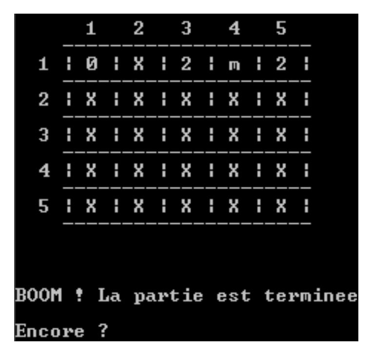

# programmation-du-jeu-démineur

### :dart: Ce projet met en pratique l’utilisation des tableaux et des pointeurs, par l'implémentation du jeu démineur.

Le but du jeu démineur consiste à localiser toutes les mines dans le plan de jeu et ce sans les faire exploser. Pour cela, il faut découvrir les cases pour savoir ce qu'il y a en dessous. 

Deux tableaux de taille identique sont utilisés pour représenter le jeu. La figure suivante présente le plan du jeu affiché:

    

> Une mine est représentée par le caractère (‘M’) -
> Un chiffre est représenté par le caractère correspondant -
> Une case non jouée est représentée par un ‘x’.

 

:white_check_mark: Lorsque une case est découverte, soit c'est une mine (‘M’) et la partie est perdue, soit ce n'est pas une mine et un chiffre apparaît qui indique le nombre de mines contiguës à cette case. Lorsque tous les chiffres sont découverts, La partie est gagnée.

 

* Le programme principal saisie et valide d’abord un nombre de lignes (max. 10) et un nombre de colonnes (max. 15) pour le plan de jeu.
* Le programme demande ensuite le nombre de mines à insérer dans le jeu (minimum 10% des cases du jeu et maximum 80% des cases).
* Ensuite, le programme initialise le plan de jeu et le plan de jeu affiché.
* Il affiche alors le jeu et débute une partie.
* Lorsque la partie est terminée, le programme se termine.

